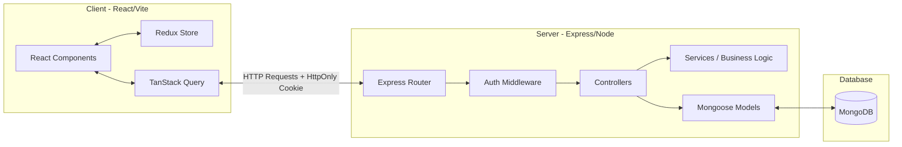
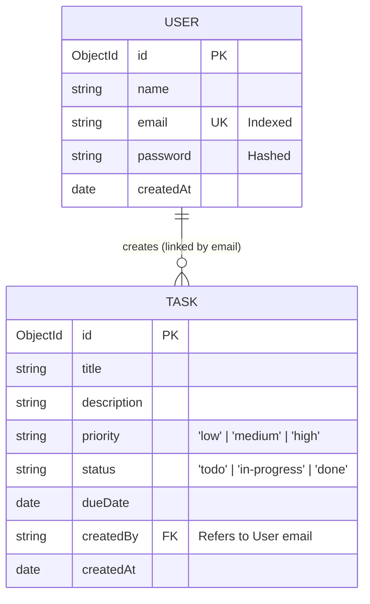

# FlowBoard Architecture Documentation

This document explains the architectural patterns, design choices, folder structure, database schema, authentication mechanisms, and trade-offs of the FlowBoard application.

---

## 🏗️ System Overview

FlowBoard uses a decoupled **Client-Server Architecture** linked via a secure REST API. 



---

## 📂 Folder Structure Rationale

The project is split into isolated `client` and `server` directories to allow independent building, testing, and containerization.

### Frontend (`client/src`)
*   `api/`: Contains central fetch configurations (`client.ts`). Isolates raw HTTP logic from components.
*   `components/`: Grouped modularly by features (e.g., `auth`, `dashboard`, `tasks`, `common`). Promotes high component cohesion and reuse.
*   `hooks/`: Features custom hooks like `useTasks.ts` using TanStack Query. Keeps asynchronous server state synchronization completely out of UI render layers.
*   `store/`: Handles client-only global state (e.g., authentication status, active UI states) using Redux Toolkit slices.
*   `pages/`: Root layouts corresponding to client-side routes.
*   `routes/`: Houses route configurations, protected route wrappers, page lazy-loading wrappers, and router error boundaries.

### Backend (`server/src`)
*   `config/`: Exposes environment and config validations.
*   `models/`: Mongoose schemas defining database entities and validating documents.
*   `routes/`: Registers routes and mounts controllers, secured by rate limiters and auth filters.
*   `middleware/`: Express middleware pipelines (global error handler, rate limiters, auth checks).
*   `controllers/`: Manages request parsing and response structures.
*   `services/`: Encapsulates all application business rules and database queries. Ensures controllers stay thin and readable.

---

## 🗄️ Database Schema Design

FlowBoard stores records in MongoDB using two collections modeled via Mongoose.



### Key Decisions:
1.  **Email as Foreign Key Reference:** The `Task` schema links tasks to their creator using the creator's `email` (as a lowercase string) rather than a MongoDB `ObjectId`. While unconventional, this matches frontend expectations and simplifies quick rendering of author emails without needing complex `$lookup` aggregations.
2.  **Enums for Constraints:** Both `priority` and `status` use Mongoose validation enums to prevent invalid states at the database level.
3.  **JSON Transformation:** Custom `toJSON` transformations are used in both schemas to convert `_id` to a clean `id` string and strip sensitive fields (like hashed passwords) before documents leave the backend.

---

## 🔐 Authentication Flow

FlowBoard uses a stateless, token-based session model using **JSON Web Tokens (JWT)**.

```
[Browser]                                            [Express Backend]
    |                                                       |
    |---- 1. POST /api/auth/login (email, password) ------->|
    |                                                       |-- Verifies Password
    |                                                       |-- Generates JWT
    |<--- 2. Response 200 OK + Sets Cookie "token" ---------|
    |        (Cookie: HttpOnly, SameSite=Lax, Secure)       |
    |                                                       |
    |---- 3. GET /api/tasks (Cookie sent automatically) ---->|
    |                                                       |-- authMiddleware parses cookie
    |                                                       |-- Attaches req.user
    |<--- 4. Response 200 OK (User's tasks) ----------------|
```

### Security Configurations:
*   **HttpOnly:** Protects the token from being accessed or stolen by malicious client-side JavaScript (prevents XSS leaks).
*   **SameSite=Lax:** Restricts cookie sharing in cross-site contexts (protects against CSRF).
*   **Secure:** Set dynamically to `true` in production mode (requires HTTPS).

---

## ⚖️ Architectural Trade-offs

### 1. MongoDB vs. Relational SQL
*   **Trade-off:** We chose MongoDB because it supports rapid prototyping and schema flexibility.
*   **Consequence:** We sacrifice strict relational database foreign-key cascading and transactional join operations. However, for a focused Task Management application, document isolation is sufficient and ensures highly scalable reads.

### 2. HttpOnly Cookies vs. LocalStorage
*   **Trade-off:** We chose HttpOnly cookies to store the authentication token.
*   **Consequence:** This makes the system significantly more secure against XSS attacks. However, it means the client-side JavaScript cannot directly read the token metadata (like expiration time), requiring a separate `/api/auth/me` request to verify the current session status.

### 3. Task Creator linked by Email vs. ObjectId
*   **Trade-off:** We store `createdBy` on tasks as the user's email address.
*   **Consequence:** This eliminates the need to run database population/join steps to display user email addresses in client layouts. However, if a user updates their email address, we must cascade updates across all associated tasks, which would not be necessary if using immutable `ObjectIds`.

---

## 📦 External Libraries & Dependencies

We utilize several external libraries to improve stability, security, and developer experience. Below are the key packages and the rationale for choosing them:

### Frontend (Client)
*   **TanStack Query (`@tanstack/react-query`):** Manages server-state synchronization. Unlike traditional state management libraries (like raw Redux or Context API), TanStack Query handles caching, background fetching, automatic retries, and data synchronization out of the box, reducing client boilerplate code.
*   **Redux Toolkit (`@reduxjs/toolkit`):** Manages client-only global state (e.g., whether the user is logged in, sidebar toggles). Chosen for standard client-state organization with minimal boilerplate.
*   **TailwindCSS v4 & `@tailwindcss/vite`:** Utility-first CSS framework coupled with Vite compiler integration. This choice enables high-performance styles compiled natively during building.
*   **React Hook Form & Zod:** Managing forms using traditional state triggers cause massive re-renders. We choose `react-hook-form` to track uncontrolled inputs for speed, and `zod` for type-safe schema declarations that validate form schemas dynamically.

### Backend (Server)
*   **Helmet (`helmet`):** Secures HTTP response headers. By altering response headers (like disabling `X-Powered-By` and setting strict referrer policies), it prevents basic security disclosures.
*   **Express Rate Limit (`express-rate-limit`):** Restricts requests to authentication endpoints. This helps mitigate brute-force and credential stuffing attacks on our user authentication endpoints.
*   **Zod (`zod`):** Used in backend middlewares to validate incoming request bodies. This keeps API route controllers clean by failing requests early before hitting databases.
*   **TSX (`tsx`):** A fast TypeScript runner. We use `tsx watch` during development to bypass manual `tsc` compilation loops, allowing the server to restart in milliseconds when files change.
